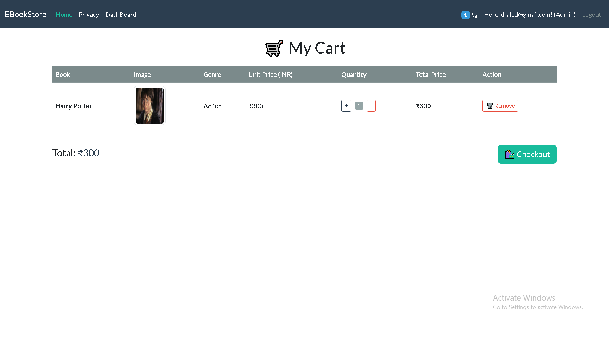
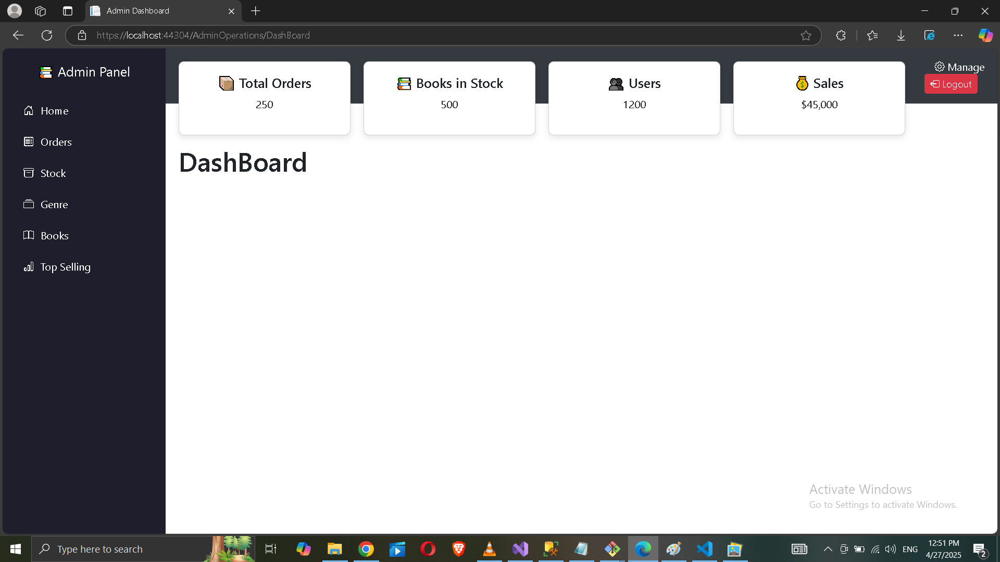
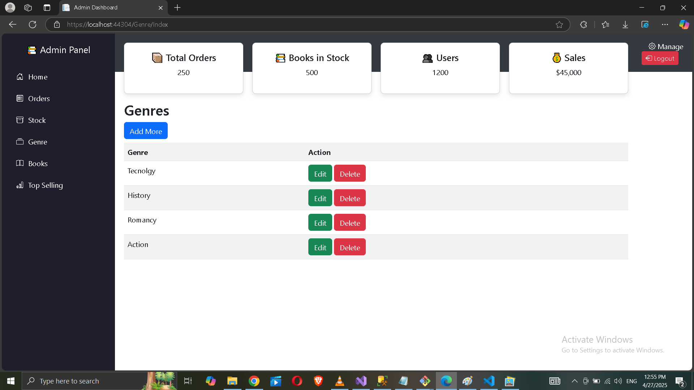
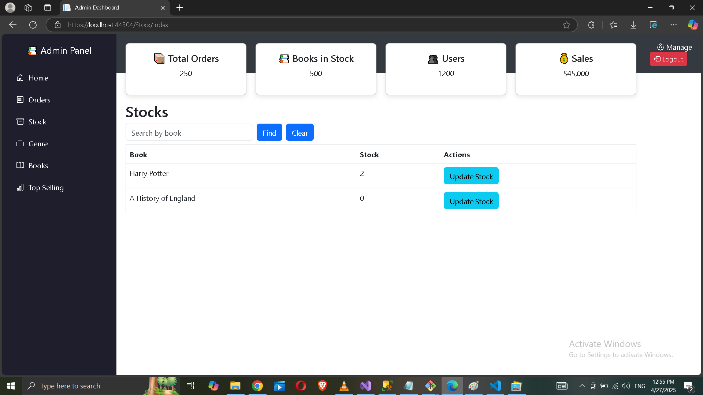
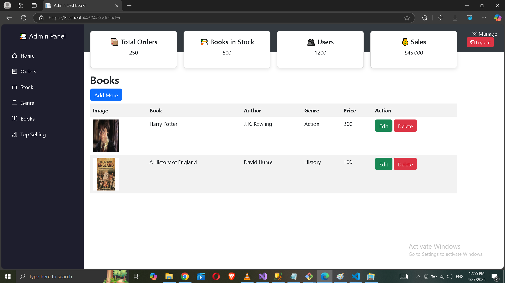
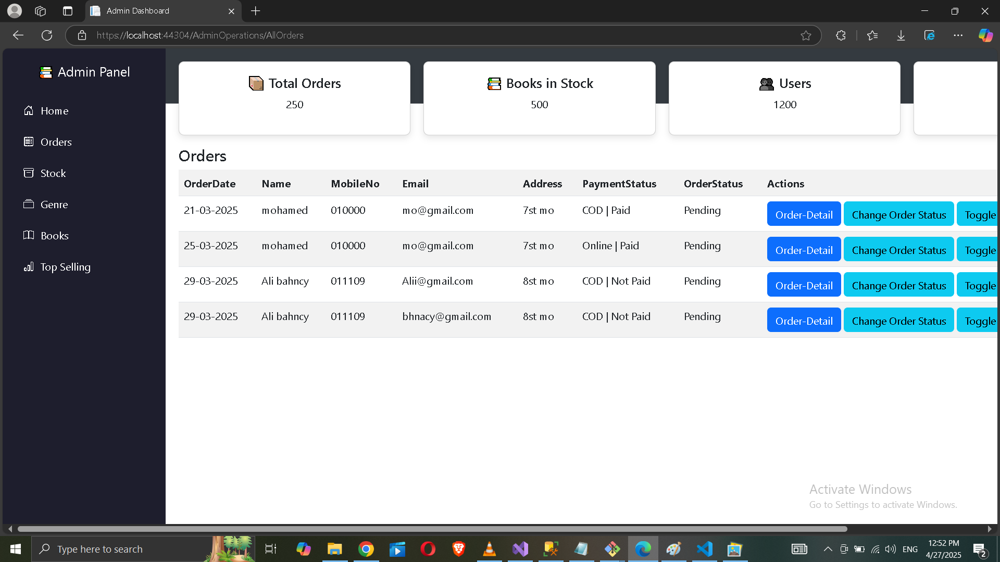

# 📚 Book Shopping Website

This is a web application for managing and selling books online.  
It includes an Admin Dashboard, user authentication with Gmail, and payment integration using PayPal and Stripe.

---

## Features
- 📚 Manage books: Add, update, delete .
- 👥 Admin dashboard for managing categories, orders, and users.
- 🛒 Shopping cart functionality.
- 💳 Integrated payment gateway.
- 🔐 Secure authentication & authorization.
- 🌍 Responsive and clean UI.

---

## Tech stack 🧑‍💻

   - Dotnet core mvc (.Net 9)
   - MS SQLServer 2022 (Database)
   - Entity Framework Core (ORM)
   - Identity Core (Authentication)
   - Bootstrap 5 (frontend)


     # 📚 Book Shopping Website

This is a web application for managing and selling books online.  
It includes an Admin Dashboard, user authentication with Gmail, and payment integration using PayPal and Stripe.

---

## 🚀 Features

- 📖 Browse and search books
- 🛒 Add books to cart and checkout
- 🛡️ Admin Dashboard to manage books and orders
- 🔒 Register and login with Gmail (Google Authentication)
- 💳 Payment integration with PayPal and Stripe

---

## 📸 Screenshots

### 🖥️ Home Page


### 🖥 Registration

### 🖥 Login


### 🛒 Cart Page

###  Checkout


### 📊 Admin Dashboard


### 📊 Category

### 📊 Stock

### 📊 AddBook


###  Top Seling

### 📊 OrdersList


---


## 🔧 Technologies Used

- ASP.NET MVC
- Entity Framework
- Stripe & PayPal APIs
- Google Authentication
- SQL Server

---

## 📥 Installation

1. Clone the repository:
   ```bash
   git clone https://github.com/Mohamedkhaled030/BooksShopping.git


## Tools I have used and their alternative

- Visual Studio 2022 (Alternatives : .NET SDK + VS Code or .NET SDK + JetBrains Rider)
- Microsoft Sql Server Management Studio (Alternative : Azure data studio / mssql extension for vscode)

Note: Every tool and tech is free for personal use. 
